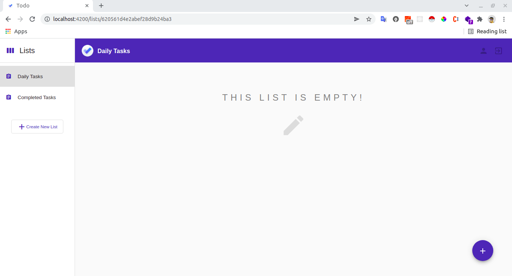
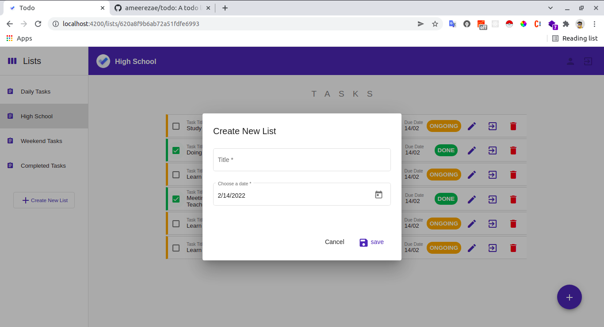
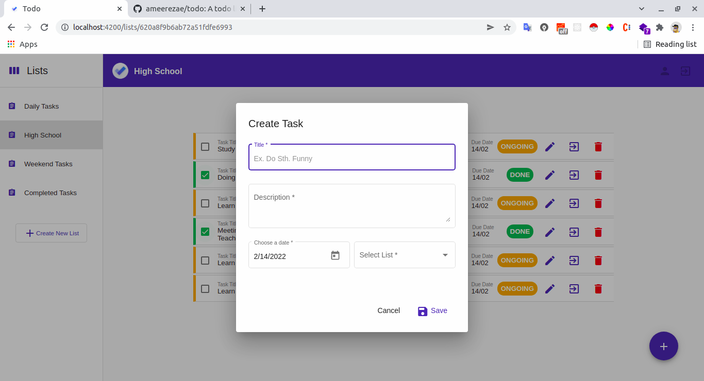
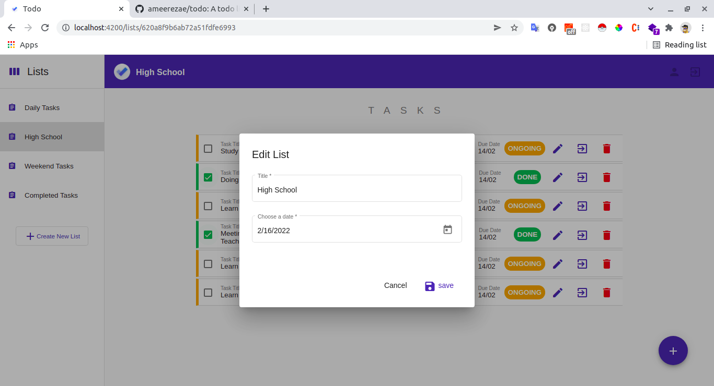
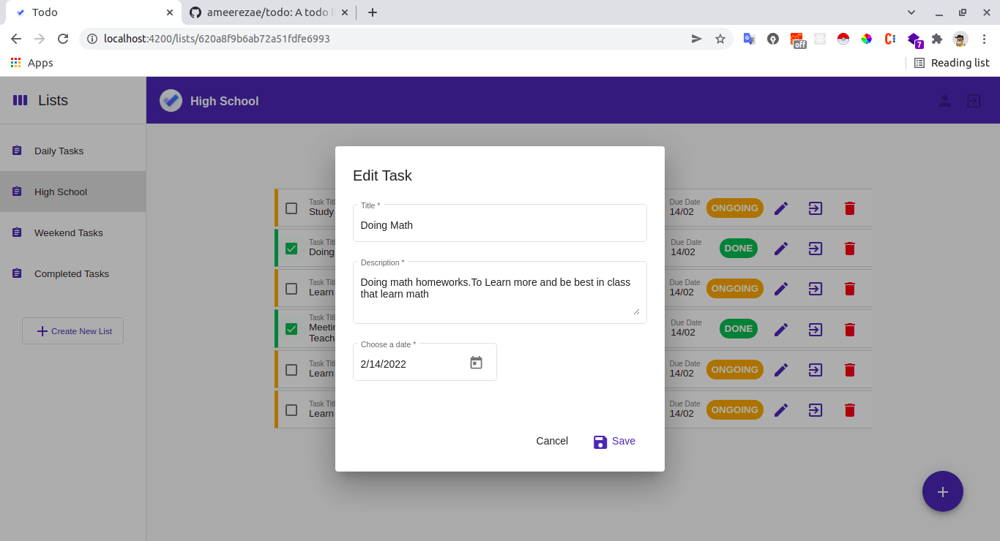
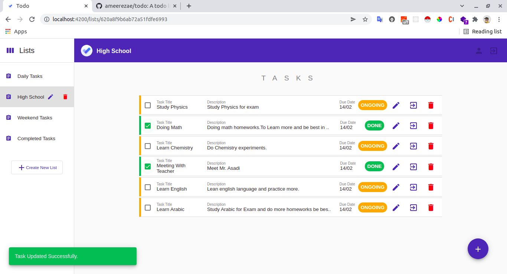
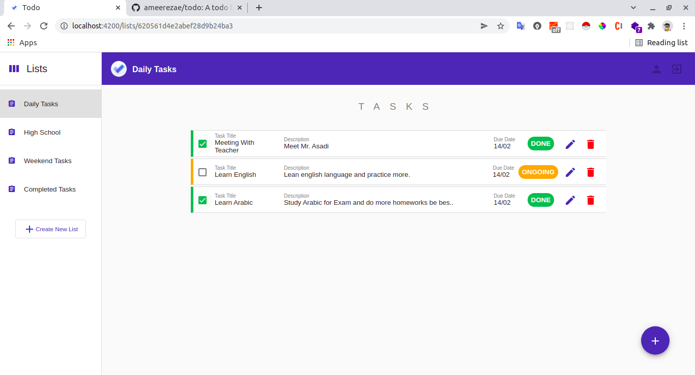
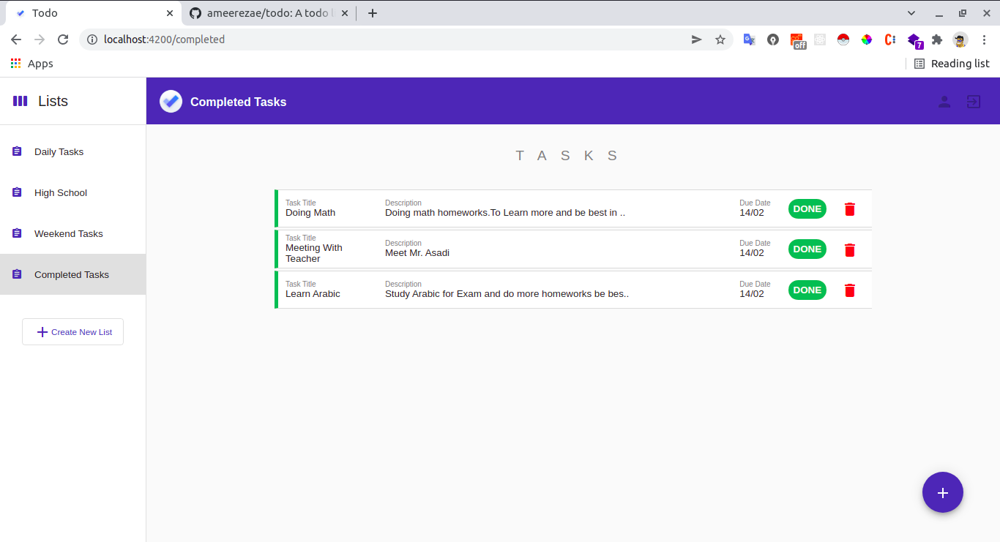
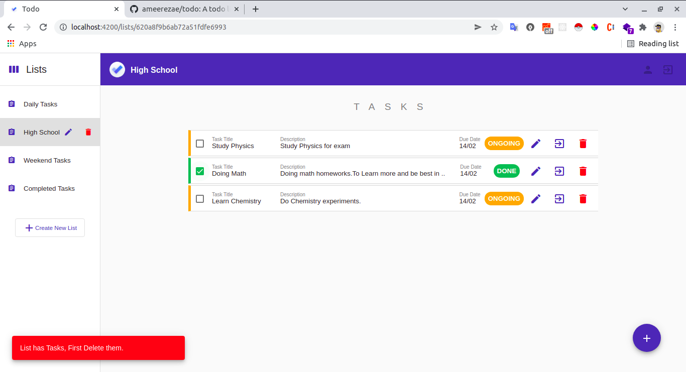
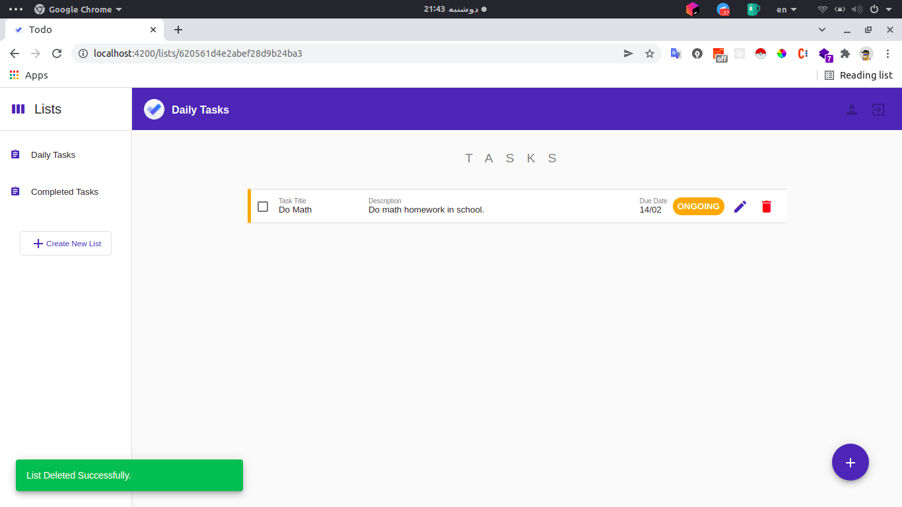

# Todo
 

## Description
Todo App using Angular13 and NgRx.
## Getting Started
### Dependencies
Dependencies are listed in `package.json` file. \
use `npm install` to install them.

### Demo

1. App Startup: \
   

1. Create List: \
   
   
1. Create Task: \
   

1. Edit List: \
   

1. Edit Task: \
   

1. New Created List Tasks (tasks can move to daily tasks, edit and delete) \
   

1. Main List (Daily Tasks). tasks can be deleted and edited: \
   

1. Completed Tasks List (tasks can be deleted): \
   

1. Delete List: 
   1. Warning when list has some tasks.
   
   
   1. Delete List if it has no tasks.
   

### Authors
Amir Rezaei [@ameerezae](https://github.com/ameerezae)
